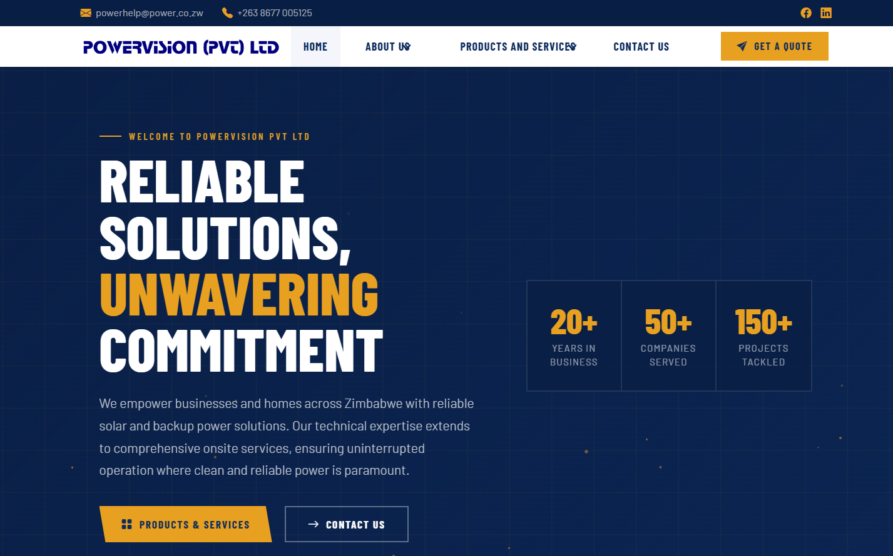

# Powervision (Pvt) Ltd – Website

Flask + HTMX website for [powervision.co.zw](https://powervision.co.zw), styled with Bulma CSS and Bootstrap Icons.



---

## Tech Stack

| Layer      | Technology                          |
|------------|-------------------------------------|
| Backend    | Python / Flask                      |
| Frontend   | Bulma CSS 0.9.4                     |
| Icons      | Bootstrap Icons 1.11.3              |
| Interactivity | HTMX 1.9.10                     |
| Fonts      | Google Fonts – Barlow & Barlow Condensed |

---


## Setup & Installation

### 1. Clone or download the project

```bash
git clone <your-repo-url>
cd powervision
```

### 2. Create a virtual environment (recommended)

```bash
python -m venv venv

# Windows
venv\Scripts\activate

# macOS / Linux
source venv/bin/activate
```

### 3. Install dependencies

```bash
pip install flask python-dotenv gunicorn
```

### 4. Add your image

Place your main photo at:

```
static/images/image.jpg
```

This image is used as the hero background and all section photos across the site.

### 5. Run the development server

```bash
python app.py
```

Open your browser at **http://localhost:5000**

---

## Pages & Routes

| Route                                        | Template                    | Description                        |
|----------------------------------------------|-----------------------------|------------------------------------|
| `/`                                          | `index.html`                | Homepage                           |
| `/about`                                     | `about.html`                | About Us                           |
| `/the-team`                                  | `team.html`                 | The Team                           |
| `/products-services`                         | `services.html`             | All Products & Services            |
| `/products-services/<slug>`                  | `service_detail_page.html`  | Individual service detail          |
| `/contact`                                   | `contact.html`              | Contact Us & quote form            |
| `/htmx/services/<id>` *(GET)*               | `partials/service_detail.html` | HTMX inline service panel       |
| `/htmx/quote` *(POST)*                      | `partials/quote_success.html`  | HTMX form success response      |

### Service Slugs

| Slug                        | Service                                  |
|-----------------------------|------------------------------------------|
| `alternative-green-energy`  | Alternative and Green Energy Solutions   |
| `electrical-installations`  | Electrical Installations                 |
| `backup-standby-power`      | Back-Up and Standby Power                |
| `power-system-protection`   | Power System Protection                  |
| `value-added-services`      | Value Added Services                     |
| `products`                  | Products                                 |

---

## HTMX Features

- **Homepage service cards** — clicking any card loads a detail panel inline below the grid without a page reload (`hx-get`, `hx-target`, `hx-swap`)
- **Contact form** — submits via HTMX and replaces the form with a success message (`hx-post`)

---

## Customisation

### Update contact details

Edit the `CONTACT` dictionary in `app.py`:

```python
CONTACT = {
    "email": "powerhelp@power.co.zw",
    "phone": "+263 8677 005125",
    "address": "P.O. Box 26, Amby Drive, Greendale, Harare, Zimbabwe",
    "facebook": "https://facebook.com/yourpage",
    "linkedin": "https://linkedin.com/company/yourpage",
}
```

### Update stats

Edit the `STATS` list in `app.py`:

```python
STATS = [
    {"value": "20+", "label": "Years in Business"},
    {"value": "50+", "label": "Companies Served"},
    {"value": "150+", "label": "Projects Tackled"},
]
```

### Add or edit a service

Each service in the `SERVICES` list in `app.py` has this structure:

```python
{
    "id": "unique-id",
    "slug": "url-slug",
    "nav_label": "Name shown in navbar dropdown",
    "icon": "bi-bootstrap-icon-name",
    "image": "path/to/image",
    "title": "Full page title",
    "tagline": "Short subtitle",
    "description": "Full paragraph description",
    "features": ["Feature 1", "Feature 2", ...],
    "products": [
        {"name": "Product Name", "detail": "Description"},
    ],
}
```

### Replace images

All section images use:

```
static/images/image.jpg
```

To use different images per page, replace the `url_for('static', filename='images/image.jpg')` references in each template with your own paths.

---

## Brand Logos

The **Brands We Work With** section on the homepage uses the [Clearbit Logo API](https://clearbit.com/logo) to load logos automatically from company domains. An `onerror` fallback shows the brand name as text if any logo fails to load.

---

## Deployment

For production, use **Gunicorn** behind **Nginx**:

```bash
pip install gunicorn
gunicorn -w 4 -b 0.0.0.0:8000 app:app
```

Set `debug=False` in `app.py` before deploying:

```python
if __name__ == "__main__":
    app.run(debug=False)
```

---

## Contact

**Powervision (Pvt) Ltd**
P.O. Box 26, Amby Drive, Greendale, Harare, Zimbabwe
+263 8677 005125
powerhelp@power.co.zw